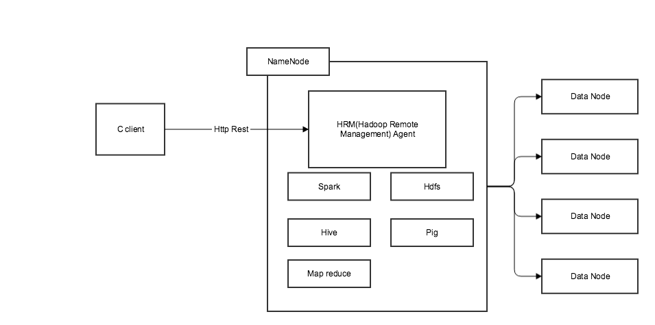
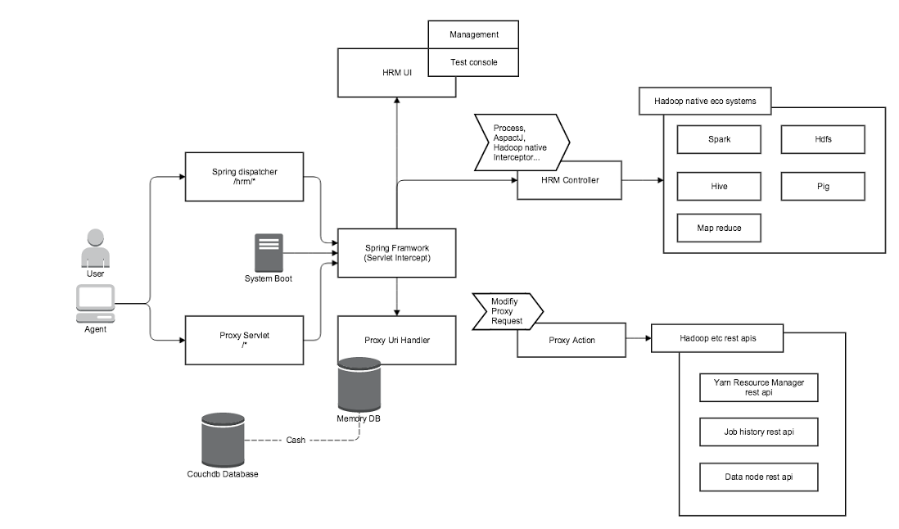
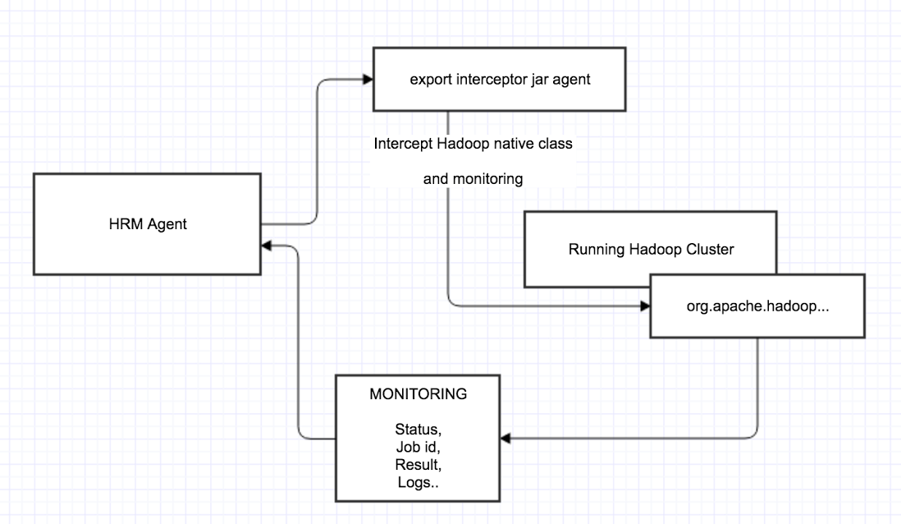

# OCE HRM

[Ambari Install](document/ambari.md)

[Installation](document/install.md)

[Tutorial](document/tutorials.md)

[Native Client Parameters](document/native.md)

[Rest Api](document/api.md)

[Java Api](document/javaApi.md)

[Service recovery](document/recovery.md)

## HRM (Hadoop Remote Management) 

HRM 은 Rest Api 로 동작하는 하둡 에코시스템 트리거입니다.
  
 - HDFS 브라우저 && Rest api 제공
 - Hive, Spark, Pig, MR, Java, Python, Shell 잡 매니지먼트 && Rest api 제공
  
HRM 의 컨셉은,  마이크로 소프트 아키텍쳐의 일환으로써,  Rest Api 기반의 에코시스템 트리거의 기능에만 집중한 프로젝트입니다.
  
HRM 의 활용은,  기존 BPMN 엔진의 액티비티가 수행해야 했던 역할을 HRM 으로의 Rest call 로 단순화 시키는데 의미가 있습니다.
  
기존 워크플로우 대비,  작고 더 자세한 기능에 집중한 결과, 발전적인 부분을 몇가지 소개시켜드리겠습니다.
  
1) 잡 스테이터스의 세분화
  
 - Stanby,Running,Finish,Fail,Killling,Killed,Kill Fail 의 잡 스테이터스가 세분화 되었습니다.
  
2) 작업 종료 기능의 구체화

 - Yarn, Mr 에 걸린 작업의 경우 종료 로그를 수집해주며,  작업 종료에 대한 상태 분석을 기존의 Async 하고 비정확한 문제를 개선하였습니다.
  
3) 작업 진행 상태 및 로그 스트리밍의 Hook url 지원
  
 - Rest 로 작업 요청시, Hook url 을 요청할 경우 작업진행 상태에 따라 노티를 날려줍니다.
  
4) Hdfs 작업의 Rest 지원
  
 - Hdfs 쓰기, 덮어쓰기, 내려받기의 작업을 Rest 처리로 가능해졌습니다.
  
5) 에코 시스템 파라미터의 구체화
  
 - 에코 시스템 클라이언트의 CLI 파라미터를 누락사항 없이 모두 코드화 하였고, ORM 방식을 적극활용하여 코드의 확장성 및 유연성을 보장합니다.
  
6) 보안
  
 - Oauth2.0 인증 방식을 사용할 수 있으며,  Api gateway 와 함께 쓰실 경우 CSB 개념의 일환으로 사용확장이 가능합니다.

## 아키텍트

### 개요

서브프로젝트의 네이밍은 HRM(Hadoop Remote Management) 입니다.
HRM 은 하둡 클러스터의 네임노드에 별도의 WAS 서버로 구동이 되게 됩니다.
HRM 이 설치된 네임노드에는 하둡 에코 시스템의 클라이언트가 구비되어있어야 합니다.

### 상세 아키텍쳐

Hadoop eco  시스템에서 자체 rest 가 제공되는 부분은 Proxy 동작으로 이어질 수 있게 하고, Spark,Hive,Pig,Hdfs MR 의 동작은 rest 가 제공되지 않거나, 
제공되더라도 클러스터 시스템의 Yarn 매니지먼트와 연계되지 않아 시스템을 Fault 시킬 위험요지가 있거나,
운용환경의 Configuration 및 보안설정으로 인해 (keberos 가 보편적) 권한이 Denined 되는 문제로 인하여,
시스템의 Native client 를 직접 호출하는 방식으로 동작합니다.

### Native Client 감지 과정

하둡 클러스터가 호출하는 org.apache.hadoop 패키지의 클래스를 모니터링하고 있다가 
하둡이 특정 클래스를 호출할 경우 인터셉터하여 agent 에서 원하는 액션을 취하도록 합니다.

