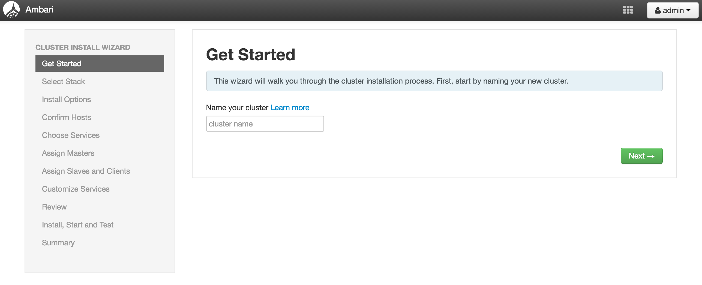
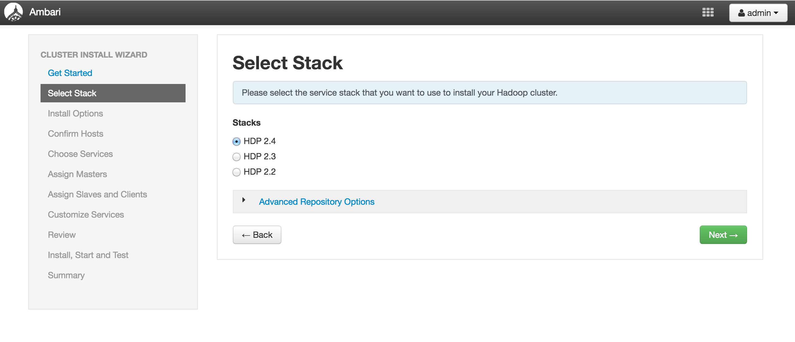
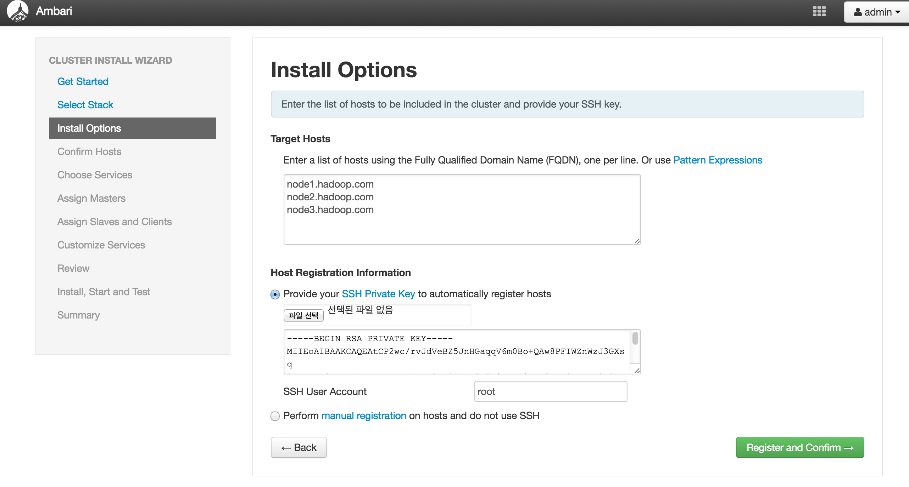
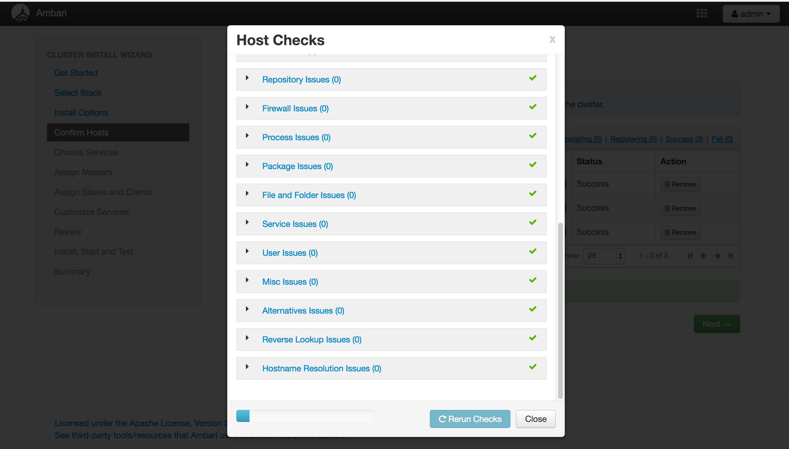
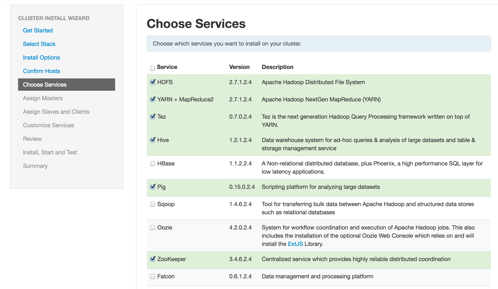
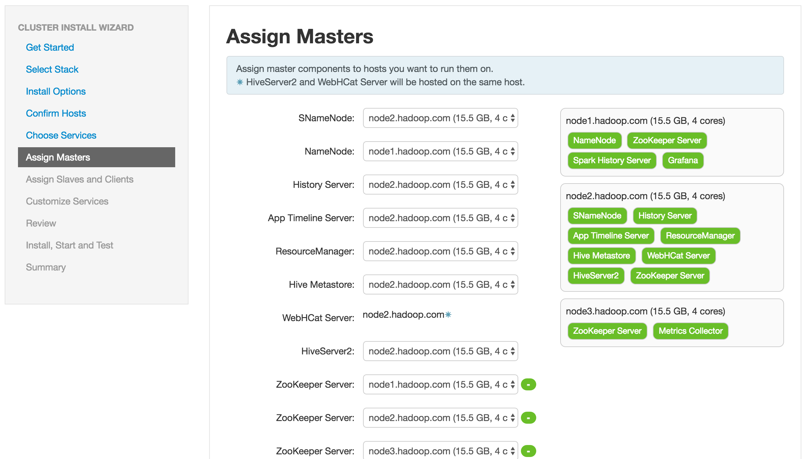
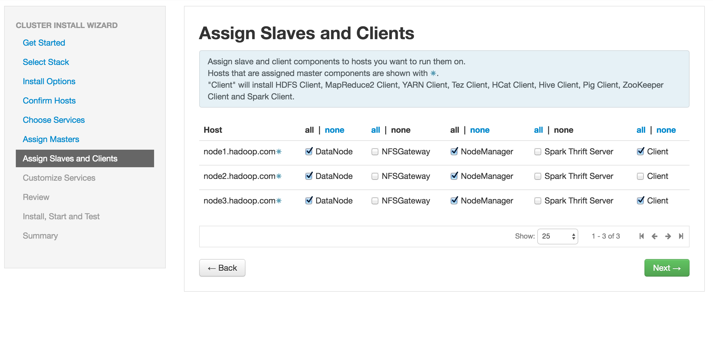
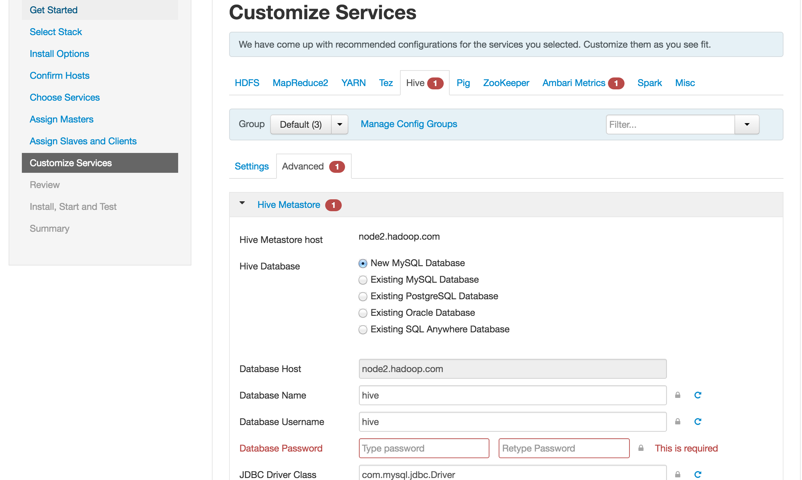
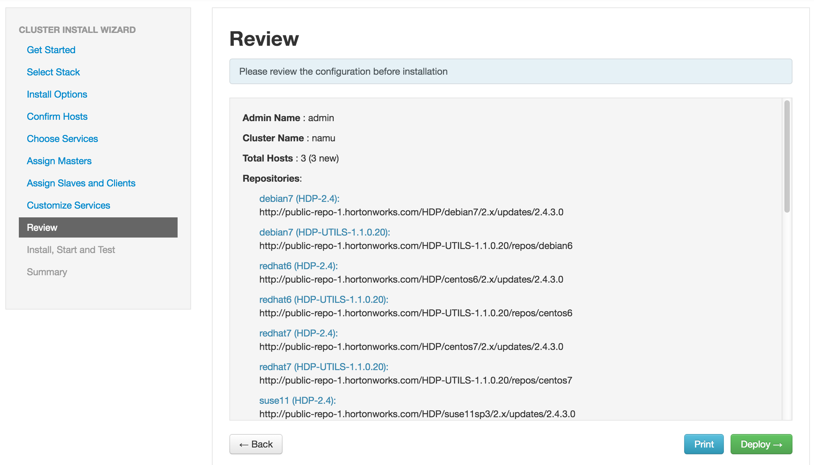
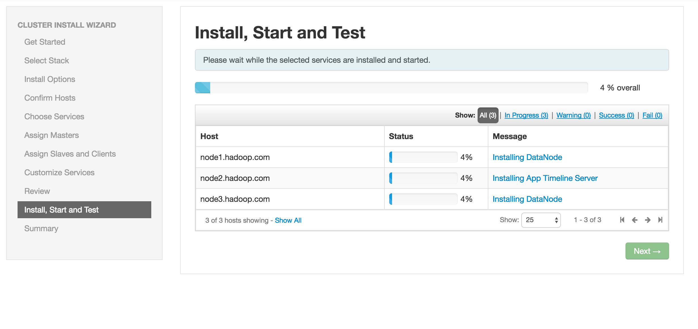

# 암바리 설치 가이드

 - [Overview](#overview)
 - [Ambari Install](#ambari-install)
 - [Create cluster](#create-cluster)
    - [Prepare requirements](#prepare-requirements)
       - [Time zone](#time-zone)
       - [Locale](#locale)
       - [Host configure](#host-configure)
       - [firewall](#firewall)
    - [Step-by-step deployment](#step-by-step-deployment)
        - [Log into Apache Ambari](#log-into-apache-ambari)
        - [Install Options](#install-options)
        - [Confirm Hosts](#confirm-hosts)
        - [Choose Services](#choose-services)
        - [Assign Masters](#assign-masters)
        - [Assign Slaves and Clients](#assign-slaves-and-clients)
        - [Customize Services](#customize-services)
        - [Review](#review)
        - [Install, Start and Test](#install-start-and-test)
   
 - [Re Deploy Cluster](#re-deploy-cluster)
    - [Remove Ambari master](#remove-ambari-master)
    - [Clean Up host nodes](#clean-up-host-nodes)
    
    
## Overview

하기의 모든 절차는 원할한 진행을 위해 root 계정으로 진행하실 것을 추천드립니다. root 계정 이외의 시스템계정으로 진행하는 것은 본 가이드에서 테스트하지 않았습니다.

## Ambari Install

[Ambari Install Guide](https://cwiki.apache.org/confluence/display/AMBARI/Ambari)

암바리 레파지토리를 추가하고 인스톨을 진행합니다.

```
$ cd /etc/yum.repos.d/

$ yum install wget

$ wget http://public-repo-1.hortonworks.com/ambari/centos6/2.x/updates/2.2.2.0/ambari.repo

$ yum install ambari-server
```

호스트 네임을 설정하고 selinux 를 disabled 설정하고, iptables 를 종료시킵니다.

```
$ vi /etc/sysconfig/network
.
.
NETWORKING=yes
HOSTNAME=ambari.hadoop.com

$ vi /etc/sysconfig/selinux
.
.
SELINUX=disabled

$ service iptables stop

$ hostname ambari.hadoop.com
```

컨피규레이션을 실행하고 서비스를 시작합니다.

```
$ ambari-server setup

Using python  /usr/bin/python
Setup ambari-server
Checking SELinux...
SELinux status is 'enabled'
SELinux mode is 'permissive'
WARNING: SELinux is set to 'permissive' mode and temporarily disabled.
OK to continue [y/n] (y)? y   ==> selinux 권한 변경 y
Customize user account for ambari-server daemon [y/n] (n)? n
Adjusting ambari-server permissions and ownership...
Checking firewall status...
Checking JDK...
[1] Oracle JDK 1.8 + Java Cryptography Extension (JCE) Policy Files 8
[2] Oracle JDK 1.7 + Java Cryptography Extension (JCE) Policy Files 7
[3] Custom JDK
==============================================================================
Enter choice (1): 1
To download the Oracle JDK and the Java Cryptography Extension (JCE) Policy Files you must accept the license terms found at http://www.oracle.com/technetwork/java/javase/terms/license/index.html and not accepting will cancel the Ambari Server setup and you must install the JDK and JCE files manually.
Do you accept the Oracle Binary Code License Agreement [y/n] (y)? y
Downloading JDK from http://public-repo-1.hortonworks.com/ARTIFACTS/jdk-8u60-linux-x64.tar.gz to /var/lib/ambari-server/resources/jdk-8u60-linux-x64.tar.gz
jdk-8u60-linux-x64.tar.gz... 5% (10.0 MB of 172.8 MB
.
.
.
Enter advanced database configuration [y/n] (n)? n   ==> 커스텀 데이터 베이스 설정 n

$ ambari-server start
```
암바리 서버의 url 로 접근하여 시스템이 구동되었는지 확인하여 봅니다.

 - http://<host>:8080

## Create cluster

다음은 암바리 서비스에서 클러스터를 설치하기 위한 과정입니다.

### Prepare requirements

암바리를 설치하기 위한 클러스터의 준비 노드마다 다음의 작업을 수행해야 합니다.

#### Time zone

모든 서버의 타임존을 동기화 하도록 합니다.(암바리 설치 서버 포함)

```
$ vi /etc/sysconfig/clock

ZONE="Asia/Seoul"

```

ntp 를 사용하여 모든 서버의 시간 설정을 동기화합니다.

```
$ yum install ntp ntpdate

$ chkconfig ntpd on
$ service ntpd restart
Shutting down ntpd:                                        [FAILED]
Starting ntpd:                                             [  OK  ]

$ ntpq -dp
1 packets reassembled into response
     remote           refid      st t when poll reach   delay   offset  jitter
==============================================================================
2 packets reassembled into response
*dadns.cdnetwork 131.107.13.100   2 u    2   64    1    1.581   81.335   0.609
2 packets reassembled into response
 115.90.134.38   133.243.238.163  2 u    1   64    1    4.571   77.837   0.710
```

#### Locale

모든 서버의 locale 을 utf-8 로 통일하도록 합니다.(암바리 설치 서버 포함)

```
$ localedef -c -f UTF-8 -i en_US en_US.UTF-8

$ export LC_ALL=en_US.UTF-8

$ locale
LANG=C
LC_CTYPE="en_US.UTF-8"
LC_NUMERIC="en_US.UTF-8"
LC_TIME="en_US.UTF-8"
LC_COLLATE="en_US.UTF-8"
LC_MONETARY="en_US.UTF-8"
LC_MESSAGES="en_US.UTF-8"
LC_PAPER="en_US.UTF-8"
LC_NAME="en_US.UTF-8"
LC_ADDRESS="en_US.UTF-8"
LC_TELEPHONE="en_US.UTF-8"
LC_MEASUREMENT="en_US.UTF-8"
LC_IDENTIFICATION="en_US.UTF-8"
LC_ALL=en_US.UTF-8
```

#### Host configure

모든 서버의 호스트 네임을 FQDN 형식으로 변경하도록 합니다.

ex) node1.hadoop.com , node2.hadoop.com ...

```
$ vi /etc/sysconfig/network
.
.
NETWORKING=yes
HOSTNAME=node1.hadoop.com

$ hostname node1.hadoop.com
```

fqdn 호스트 리스트와 실제 ip를 /etc/hosts 파일에서 추가하도록 합니다.

```
ex)

$ vi /etc/hosts
::1         localhost localhost.localdomain localhost6 localhost6.localdomain6
192.168.1.244   ambari.hadoop.com
192.168.1.241   node1.hadoop.com
192.168.1.242   node2.hadoop.com
192.168.1.243   node3.hadoop.com
```

다음은 모든 노드에서 ssh 키를 공유하기 위한 절차입니다.
 
우선, 암바리 서버에서 ssh 키를 생성하도록 합니다.

```
$ cd ~/.ssh
$ ls
authorized_keys  known_hosts
.
.

$ ssh-keygen
Generating public/private rsa key pair.
Enter file in which to save the key (/root/.ssh/id_rsa): 
Enter passphrase (empty for no passphrase): 
Enter same passphrase again: 
Your identification has been saved in /root/.ssh/id_rsa.
Your public key has been saved in /root/.ssh/id_rsa.pub.
The key fingerprint is:
10:9e:8a:e4:de:0c:a2:a0:ef:da:32:a9:ad:ac:eb:02 root@ambari.hadoop.com
The key's randomart image is:
+--[ RSA 2048]----+
|      .          |
|     . o         |
|  .   +          |
| o . . .         |
|o + .   S        |
|Eo +             |
|+.. o            |
|*+               |
|@X=              |
+-----------------+
$ ll
total 16
-rw-r--r--. 1 root root  398 Aug  4 03:08 authorized_keys
-rw-------. 1 root root 1671 Sep 30 16:07 id_rsa
-rw-r--r--. 1 root root  404 Sep 30 16:07 id_rsa.pub
-rw-r--r--. 1 root root  391 Aug  4 03:07 known_hosts
```

생성된 id_rsa.pub 의 내용을 모든 노드의 authorized_keys 파일에 추가하도록 합니다.

```
$ vi .ssh/authorized_keys
.
.
id_rsa.pub 내용 추가
```

#### firewall

모든 서버의 selinux disable 처리 및 iptables 를 종료하도록 합니다.

```
$ vi /etc/sysconfig/selinux
.
.
SELINUX=disabled

$ service iptables stop
```

## Step-by-step deployment

### Log into Apache Ambari

암바리 url 로 접속하여, 초기 아이디 / 패스워드 admin/admin 으로 접속합니다.

처음 화면의 Create Cluster 버튼을 클릭하도록 합니다.

#### Cluster Info

클러스터 이름을 등록하고, HDFS 버젼을 선택합니다.





#### Install Options

인스톨 옵션에서 설치할 호스트 리스트를 씁니다.

앞선 [Host configure](#host-configure) 과정에서 생성한 ssh key 중에서 id_rsa.pub(private key) 의 내용을 화면에 붙여놓도록 합니다.



#### Confirm Hosts

위 단계에서 입력한 private 키로 암바리 서버가 인스톨 전 밸리데이션을 수행합니다.

private 키를 제대로 입력하지 않았다면 오류가 일어납니다.

벨리데이션 수행과 동시에 암바리 에이전트 설치를 진행합니다.



잠시 후 호스트 체크 후 조치 권고 사항에 대한 리스트가 팝업됩니다.

조치 권고 사항 중 Package Issue, User Issue, File and Folder Issue 는 권고 사항 대로 조치를 해야 오류가 나지 않습니다.
 
위의 세가지 사항은 보통 한번 이상 인스톨을 실패하게 되면 남아있는 하둡의 가비지 때문에 일어나게 됩니다.

#### Choose Services

설치할 에코 시스템 서비스를 선택합니다.



#### Assign Masters

각 서비스를 배치할 노드를 선택합니다.

초기 설치때는 암바리에서 설정해주는 세팅값을 그대로 사용할 것을 권장합니다.

만일 임의의 배치가 필요하시다면, 모든 설치 과정이 끝난 후 암바리 메뉴를 통해 조정하시길 바랍니다.



#### Assign Slaves and Clients

각 노드의 Hdfs 데이터노드 및 네임노드, 슬레이브 노드를 설정합니다.

초기 설치때는 암바리에서 설정해주는 세팅값을 그대로 사용할 것을 권장합니다.

만일 임의의 배치가 필요하시다면, 모든 설치 과정이 끝난 후 암바리 메뉴를 통해 조정하시길 바랍니다.



#### Customize Services

설치할 서비스를 커스터마이징 합니다.

데이터 베이스 관련 항목들은 사용자이름 / 패스워드를 입력해야 다음단계로 넘어갈 수 있습니다.



#### Review

최종 설치 전에 설정했던 값들의 리뷰 화면입니다.
 


#### Install, Start and Test

설치를 진행하고 각 서비스들을 시작하며 테스트를 수행합니다.

만일 이 단계에서 실패를 하고, 트러블 슈팅으로 해결하였다 하더라도 설치 전 단계로 돌아가서 재설치 할 수 있는 방법은 없습니다.

이 경우는 처음부터 설치 과정을 다시 실행하셔야 하는데 아래 절차를 통해 복구과정을 거치시길 바랍니다.

[Clean Up Ambari master](#clean-up-ambari-master)

[Clean Up host nodes](#clean-up-host-nodes)



모든 절차가 끝나면 아래와 같은 상태창이 나타나야 합니다.


### Re Deploy Cluster

클러스터 배포 과정중 오류가 날 경우 복구과정입니다. 

#### Clean Up Ambari master

암바리가 설치된 서버에서 다음 명령을 수행하십시오.

```
$ ambari-server stop
Using python  /usr/bin/python
Stopping ambari-server
Ambari Server stopped

$ ambari-server reset
Using python  /usr/bin/python
Resetting ambari-server
**** WARNING **** You are about to reset and clear the Ambari Server database. This will remove all cluster host and configuration information from the database. You will be required to re-configure the Ambari server and re-run the cluster wizard. 
Are you SURE you want to perform the reset [yes/no] (no)? y
Confirm server reset [yes/no](no)? y
Resetting the Server database...
Connecting to local database...done.

$ ambari-server start
```

#### Clean Up host nodes

다음은 모든 설치에 대한 가비지 및 설정 파일을 완전히 삭제하는 스크립트 입니다.

이 스크립트를 암바리 서버를 제외한 모든 노드에서 실행하시되, 설치 과정 중 오류 단계에 따라 패키지는 삭제할 필요가 없을 수 있습니다.

```
# 암바리에서 제공하는 클린업 스크립트
python /usr/lib/python2.6/site-packages/ambari_agent/HostCleanup.py --silent --skip=users

# 에이전트 정지 및 삭제
ambari-agent stop
yum erase -y ambari-agent
rm -rf /var/lib/ambari-agent
rm -rf /var/run/ambari-agent
rm -rf /usr/lib/amrbari-agent

# 관련 프로세스 정지
pkill -f java
pkill -f hdfs
pkill -f hadoop
pkill -f hive
pkill -f yarn
pkill -f spark
pkill -f mysql
pkill -f postgres

# 패키지 삭제 내용
yum remove -y hdp* hadoop* hdfs* zookeeper* hive* hbase* tez* mysql* postgres*
yum erase -y hdp* hadoop* hdfs* zookeeper* hive* hbase* tez* mysql* postgres*

# 사용자 삭제
userdel hive
userdel mapred
userdel hbase
userdel ambari-qa
userdel zookeeper
userdel tez
userdel hdfs
userdel yarn
userdel hcat
userdel spark
userdel ams

# 관련 폴더 삭제
rm -rf /etc/hadoop
rm -rf /etc/hbase
rm -rf /etc/hive
rm -rf /etc/zookeeper
rm -rf /etc/hive-hcatalog
rm -rf /etc/tez
rm -rf /etc/hive-webhcat
rm -rf /etc/spark
rm -rf /etc/pig
rm -rf /etc/ambari-metrics-monitor
rm -rf /var/run/hadoop
rm -rf /var/run/hbase
rm -rf /var/run/hive
rm -rf /var/run/zookeeper
rm -rf /var/run/hive-hcatalog
rm -rf /var/run/webhcat
rm -rf /var/run/hadoop-yarn
rm -rf /var/run/hadoop-mapreduce
rm -rf /var/run/spark
rm -rf /var/run/ambari-metrics-monitor
rm -rf /var/log/hadoop
rm -rf /var/log/hbase
rm -rf /var/log/hive
rm -rf /var/log/zookeeper
rm -rf /var/log/hive-hcatalog
rm -rf /var/log/hadoop-yarn
rm -rf /var/log/hadoop-mapreduce
rm -rf /var/log/spark
rm -rf /var/log/ambari-metrics-monitor
rm -rf /usr/lib/flume
rm -rf /usr/lib/storm
rm -rf /var/lib/hive
rm -rf /var/lib/hadoop-hdfs
rm -rf /var/lib/hadoop-yarn
rm -rf /var/lib/hadoop-mapreduce
rm -rf /hadoop/zookeeper
rm -rf /hadoop/hdfs
rm -rf /hadoop/yarn
rm -rf /var/log/webhcat
```


