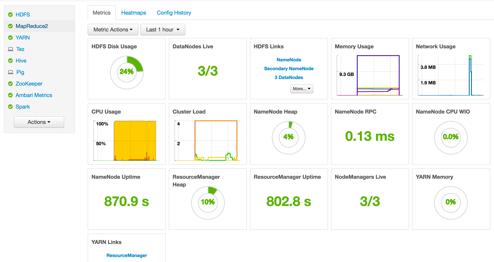

# 암바리 && HRM 서비스 재시동 가이드

## Ambari Restart

암바리 설치 노드에서 다음 명령어를 실행합니다.

```
$ ambari-server restart
```

암바리 서버의 url 로 접근하여 시스템이 구동되었는지 확인하여 봅니다.

 - http://<host>:8080

하둡 에코시스템의 노드를 재부팅했다면, 아래 그림과 같이 서비스 정상의 이미지가 아니라, 모든 서비스가 알럿 상태에 들어가 있게 됩니다.



좌측의 Actions 탭에서 '모두 시작' 버튼을 클릭하여 서비스를 재구동합니다.

**주의**

```
이 단계에서 만약 서비스들의 시작이 실패했다면, 노드간의 네트워크가 모두 열려있는지 확인하십시오.
iptables 를 꼭 끄지 않더라도, 특정 ip 간의 접속 허용을 해놓으셔도 됩니다.
```

모든 서비스들이 정상적으로 구동되는것을 확인하였다면 HRM 을 구동시키도록 합니다.

## HRM Restart

HRM 이 설치된 노드(네임노드) 에서 톰캣을 재실행합니다.

```
$ <tomcatHome>/bin/startup.sh
```


