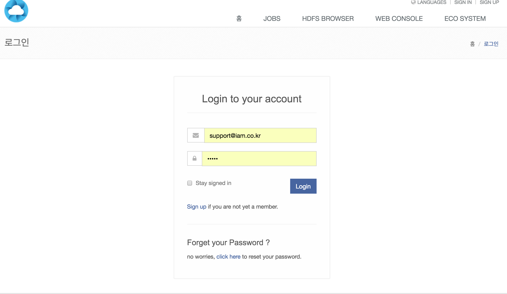
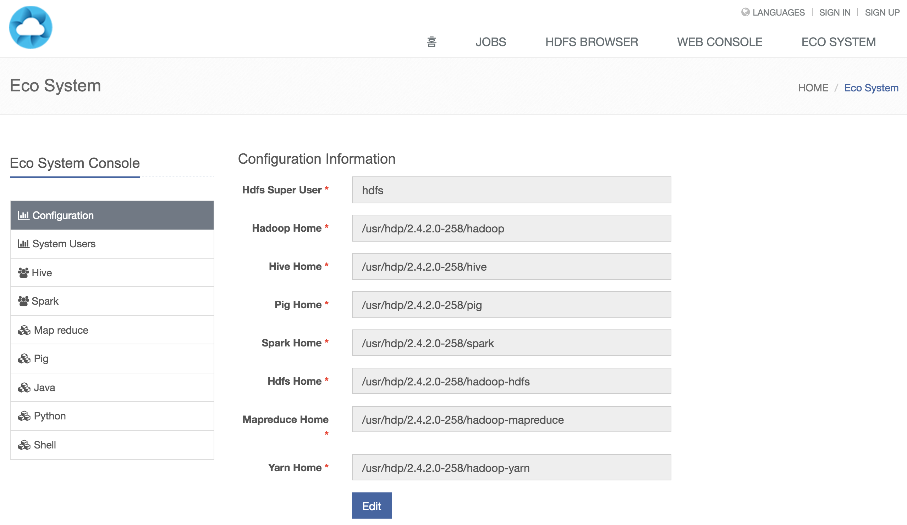
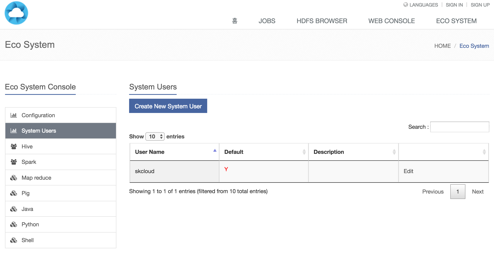
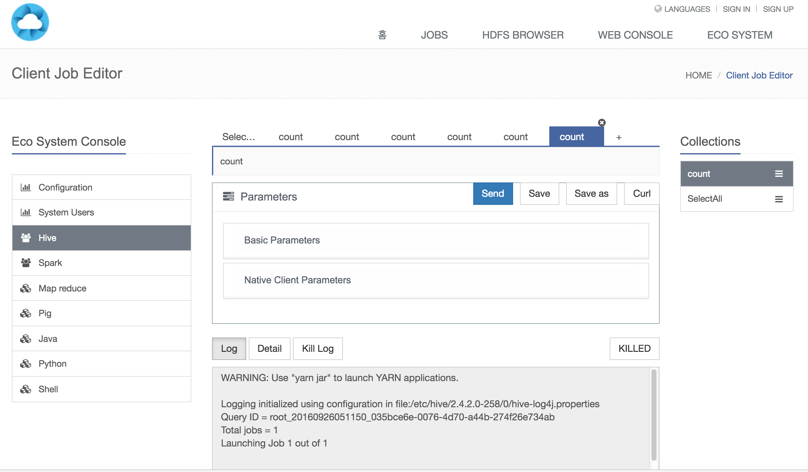

# Tutorial

## 로그인

초기 로그인 아이디와 패스워드는 support@iam.co.kr / admin 입니다.

## Eco System - Configuration

Configuration 메뉴에서 하둡 에코 시스템의 홈 디렉토리와 HDFS 슈퍼 유저를 입력합니다.

 - Hdfs Super User : 하둡 슈퍼 유저
 - Hadoop Home : 하둡 홈
 - Hive Home : 하이브 홈
 - Pig Home : 피드 홈
 - Spark Home : 스파크 홈
 - Hdfs Home : Hdfs 홈
 - Mapreduce Home : 맵리듀스 홈
 - Yarn Home : 얀 홈

## Eco System - System Users

하둡 에코시스템에서 시스템 유저를 추가하고 삭제할 수 있는 메뉴입니다.

## Eco System - Eco systems

에코 시스템 메뉴에서 호출 할 수 있는 항목은 다음과 같습니다.

 - Hive
 - Spark
 - Map Reduce
 - Pig
 - Java
 - Python
 - Shell
 
각 콘솔 메뉴 클릭시, 다음과 같은 화면이 나타납니다.

### Parameters

콘솔 메뉴의 파라미터는 Basic Parameter 와 Native Client Parameter 메뉴로 나뉩니다.

### Basic Parameter

Basic Parameter 는 공통 파라미터로서, Job 의 이벤트 훅 및 디폴트 유저를 설정할 수 있습니다. 

 - clientJobId (optional) : 클라이언트 잡의 PK 입니다. 빈 값일 경우 랜덤한 스트링을 부여하게 됩니다. 
 - clientJobName (optional): 클라이언트 잡의 네임.
 - streamingHook (optional): 잡이 실행되는 동안 발생하는 로그를 지정된 url 로 송출합니다.
 - doAs (optional) : 잡이 실행되는 동안 적용될 리눅스 시스템의 하둡 사용자 입니다. ex)ubuntu 
 - eventHook (optional) : 잡이 실행되는 동안 status 변화가 생길 때 지정된 url 로 송출합니다.
 
### Native Client Parameter

Native Client Parameter 는 각 에코 시스템에 특화된 파라미터들입니다.

Native Client Parameter 는 HRM 이 설치된 Native Client 의 CLI(Command Line Interface) 의 파라미터들을 웹으로 구현한 것입니다.

### Hive

| 파리미터          | 타입                | 설명                                                                                                                        |
|-------------------|---------------------|-----------------------------------------------------------------------------------------------------------------------------|
| sql               | String              | SQL. It will save as a sql file, -f <filename>                                                                              |
| initializationSql | String              | Initialization SQL. It will save as a sql file, -i <filename>                                                               |
| define            | Map<String, String> | Variable subsitution to apply to hive commands. e.g. -d A=B or --define A=B. ex)  --define <key=value> --define <key=value> |
| database          | String              | Specify the database to use. ex) --database <databasename>                                                                  |
| hiveconf          | Map<String, String> | Use value for given property.  ex) --hiveconf <property=value> --hiveconf <property=value>                                  |
| hivevar           | Map<String, String> | Variable subsitution to apply to hive commands. e.g. --hivevar A=B.   ex) --hivevar <key=value> --hivevar <key=value>       |

### Spark

========= Normal parameters ========

| 파리미터             | 타입                | 설명                                                                                                                                                                                                                                                                                                                                                                |
|----------------------|---------------------|---------------------------------------------------------------------------------------------------------------------------------------------------------------------------------------------------------------------------------------------------------------------------------------------------------------------------------------------------------------------|
| master               | String              | spark://host:port, mesos://host:port, yarn, or local.  ex) --master MASTER_URL                                                                                                                                                                                                                                                                                      |
| deployMode           | String              | Whether to launch the driver program locally ("client") or on one of the worker machines inside the cluster ("cluster").  (Default: client).  ex) --deploy-mode DEPLOY_MODE                                                                                                                                                                                         |
| className            | String              | The entry point for your application (e.g. org.apache.spark.examples.SparkPi).  ex) --class CLASS_NAME                                                                                                                                                                                                                                                              |
| applicationJar       | String              | Path to a bundled jar including your application and all dependencies. The URL must be globally visible inside of your cluster, for instance, an hdfs:// path or a file:// path that is present on all nodes. ex) /path/to/examples.jar                                                                                                                             |
| applicationArguments | List<String>        | Arguments passed to the main method of your main class, if any.  ex) /path/to/examples.jar 10 20 30                                                                                                                                                                                                                                                                 |
| conf                 | Map<String, String> | Arbitrary Spark configuration property. ex) --conf "spark.executor.extraJavaOptions=-Dconfig.resource=app" --conf "spark.driver.extraJavaOptions=-Dconfig.resource=app"                                                                                                                                                                                             |
| name                 | String              | A name of your application. ex) --name NAME                                                                                                                                                                                                                                                                                                                         |
| jars                 | List<String>        | Comma-separated list of local jars to include on the driver and executor classpaths. ex) --jars /path/jar1,/path/jar2,/path/jar3                                                                                                                                                                                                                                    |
| packages             | List<String>        | Comma-separated list of maven coordinates of jars to include on the driver and executor classpaths. Will search the local maven repo, then maven central and any additional remote repositories given by --repositories. The format for the coordinates should be groupId:artifactId:version. ex) --packages cgroupId:artifactId:version,groupId:artifactId:version |
| excludePackages      | List<String>        | Comma-separated list of groupId:artifactId, to exclude while resolving the dependencies provided in --packages to avoid dependency conflicts. ex) --exclude-packages groupId:artifactId,groupId:artifactId                                                                                                                                                          |
| repositories         | List<String>        | Comma-separated list of additional remote repositories to search for the maven coordinates given with --packages. ex) --repositories A,B,C                                                                                                                                                                                                                          |
| pyFiles              | List<String>        | Comma-separated list of .zip, .egg, or .py files to place on the PYTHONPATH for Python apps. ex) --py-files /path/1.zip,/path/2.zip                                                                                                                                                                                                                                 |
| files                | List<String>        | Comma-separated list of files to be placed in the working directory of each executor. ex) --files /path/1.zip,/path/2.zip                                                                                                                                                                                                                                           |
| propertiesFile       | String              | Path to a file from which to load extra properties. If not specified, this will look for conf/spark-defaults.conf. ex) --properties-file /path/spark.conf                                                                                                                                                                                                           |
| driverMemory         | String              | Memory for driver (e.g. 1000M, 2G) (Default: 1024M). ex) --driver-memory 1G                                                                                                                                                                                                                                                                                         |
| driverJavaOptions    | String              | Extra Java options to pass to the driver. ex) --driver-java-options "-Daa.aa=a -Dbb.bb=b"                                                                                                                                                                                                                                                                           |
| driverLibraryPath    | String              | Extra library path entries to pass to the driver. ex) --driver-library-path /opt/cloudera/parcels/CDH-5.3.0-1.cdh5.3.0.p0.30/lib/hadoop/lib/native                                                                                                                                                                                                                  |
| driverClassPath      | String              | Extra class path entries to pass to the driver. Note that jars added with --jars are automatically included in the classpath. ex) --driver-class-path /Users/myusername/spark-1.6.1-bin-hadoop2.4/lib/postgresql-9.4.1208.jre6.jar:/Users/myusername/spark-1.6.1-bin-hadoop2.4/lib/sqljdbc4.jar                                                                     |
| executorMemory       | String              | Memory per executor (e.g. 1000M, 2G) (Default: 1G). ex) --executor-memory 1G                                                                                                                                                                                                                                                                                        |
| proxyUser            | String              | User to impersonate when submitting the application. This argument does not work with --principal / --keytab. ex) --proxy-user NAME                                                                                                                                                                                                                                 |

========= Spark standalone with cluster deploy mode only ========

| 파리미터    | 타입    | 설명                                                  |
|-------------|---------|-------------------------------------------------------|
| driverCores | Integer | Cores for driver (Default: 1). ex) --driver-cores NUM |

========= Spark standalone or Mesos with cluster deploy mode only ========

| 파리미터  | 타입    | 설명                                                                              |
|-----------|---------|-----------------------------------------------------------------------------------|
| supervise | boolean | If given, restarts the driver on failure. ex) --supervise                         |
| kill      | String  | If given, kills the driver specified. ex) --kill SUBMISSION_ID                    |
| status    | String  | If given, requests the status of the driver specified. ex) --status SUBMISSION_ID |

========= Spark standalone and Mesos only ========

| 파리미터           | 타입    | 설명                                                          |
|--------------------|---------|---------------------------------------------------------------|
| totalExecutorCores | Integer | Total cores for all executors. ex) --total-executor-cores NUM |

========= Spark standalone and YARN only ========

| 파리미터      | 타입    | 설명                                                                                                                                       |
|---------------|---------|--------------------------------------------------------------------------------------------------------------------------------------------|
| executorCores | Integer | Number of cores per executor. (Default: 1 in YARN mode, or all available cores on the worker in standalone mode). ex) --executor-cores NUM |

========= YARN-only ========

| 파리미터        | 타입         | 설명                                                                                                                                                                                                                                                                                     |
|-----------------|--------------|------------------------------------------------------------------------------------------------------------------------------------------------------------------------------------------------------------------------------------------------------------------------------------------|
| yarnDriverCores | Integer      | Number of cores used by the driver, only in cluster mode (Default: 1). ex) --driver-cores NUM                                                                                                                                                                                            |
| queue           | String       | The YARN queue to submit to (Default: "default"). ex) --queue QUEUE_NAME                                                                                                                                                                                                                 |
| numExecutors    | Integer      | Number of executors to launch (Default: 2). ex) --num-executors NUM                                                                                                                                                                                                                      |
| archives        | List<String> | Comma separated list of archives to be extracted into the working directory of each executor. ex) --archives ARCHIVES                                                                                                                                                                    |
| principal       | String       | Principal to be used to login to KDC, while running on secure HDFS. ex) --principal PRINCIPAL                                                                                                                                                                                            |
| keytab          | String       | The full path to the file that contains the keytab for the principal specified above. This keytab will be copied to the node running the Application Master via the Secure Distributed Cache, for renewing the login tickets and the delegation tokens periodically. ex) --keytab KEYTAB |